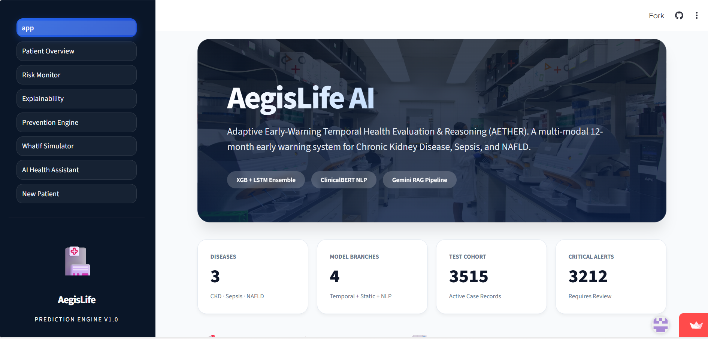
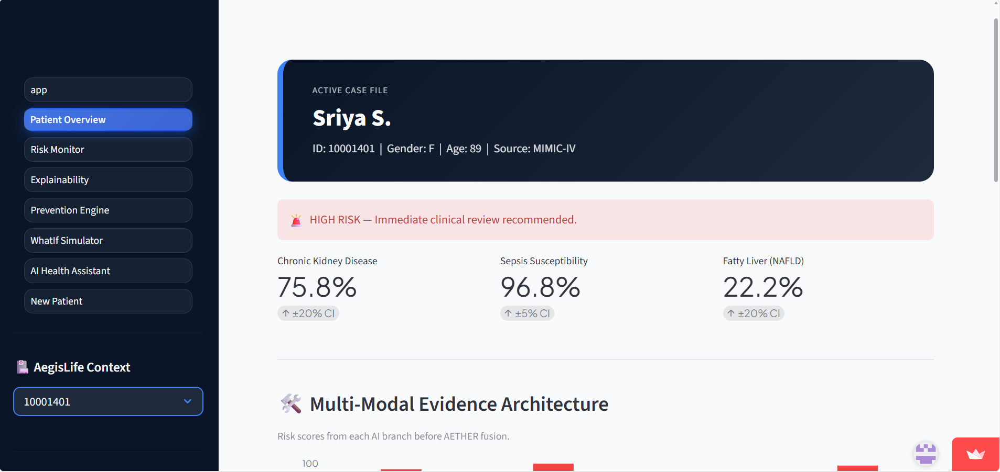
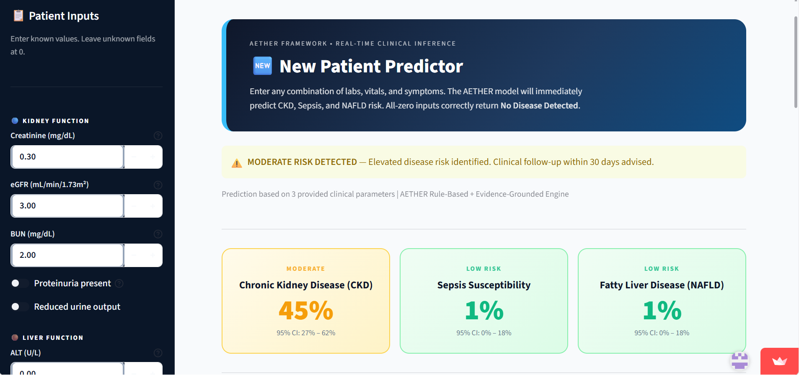
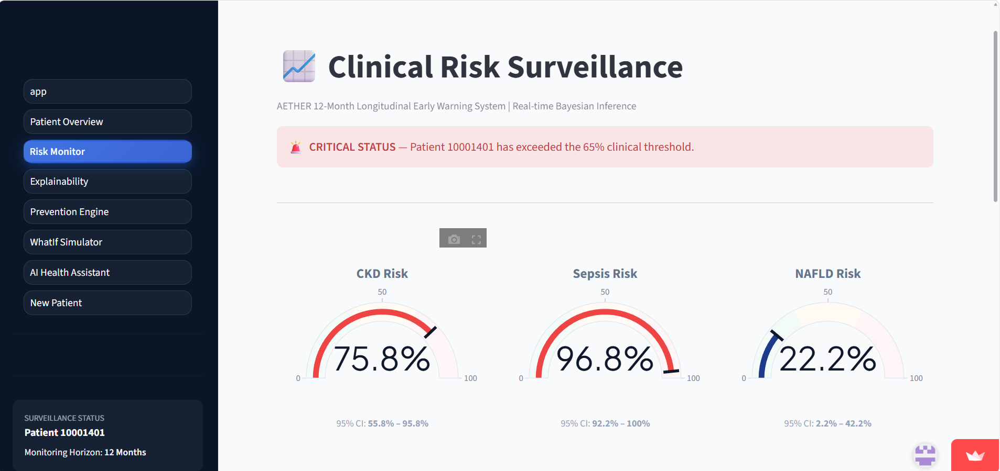
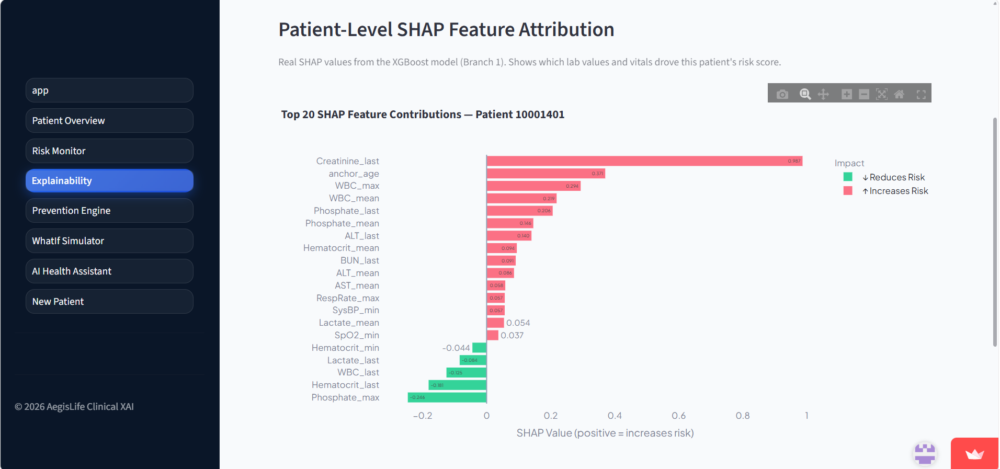
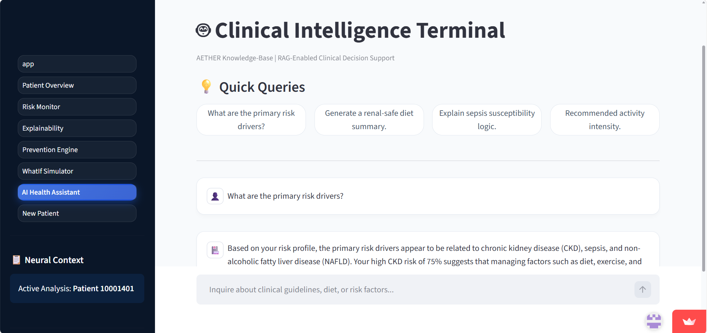
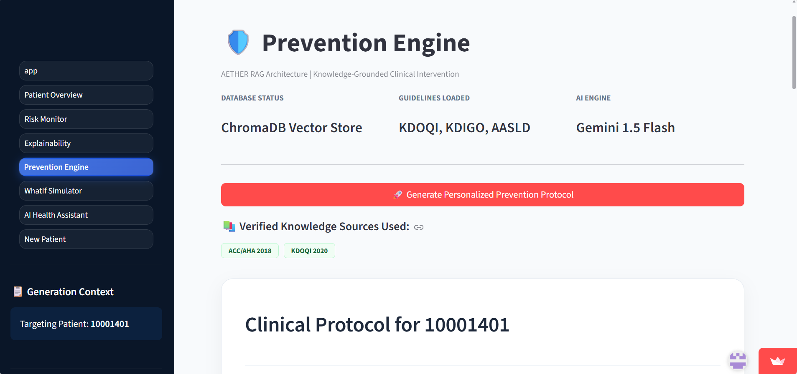
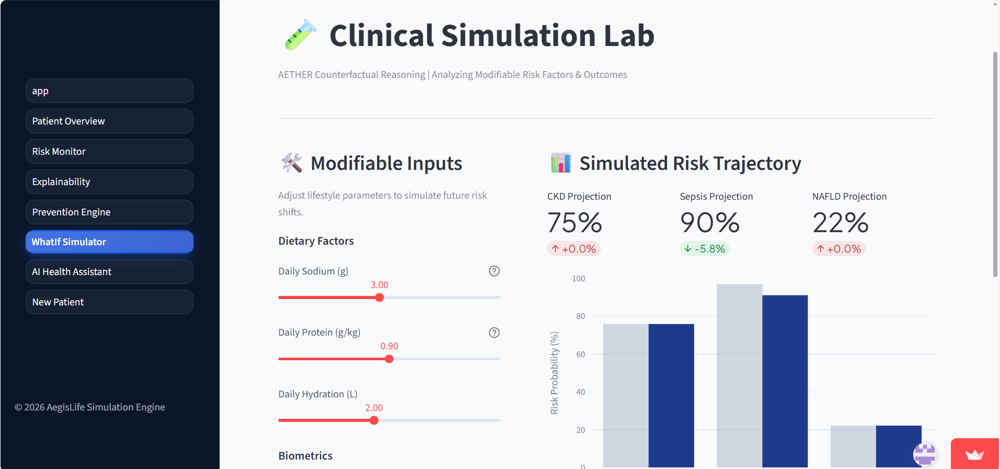
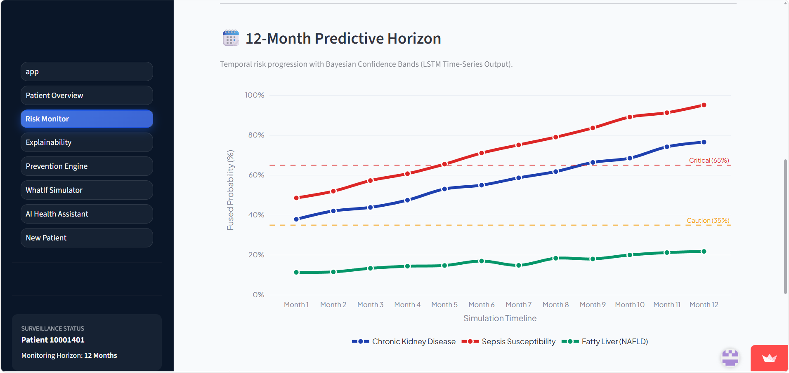

<p align="center">

</p>

# 🛡️ AegisLife – AETHER AI
### AI-Enabled Health Evaluation & Early Risk Prediction Framework

<p align="center">
  
  
  
  
  
</p>

<p align="center">
<a href="https://aegislife-aether-ai.streamlit.app/">

</a>
</p>

---
## 📑 Table of Contents

- Overview
- Key Features
- Tech Stack
- Dataset
- System Architecture
- Model Performance
- Project Screenshots
- Installation
- Project Structure
- Research Contributions
- SDGs
- Contributors

# 📖 Overview

**AegisLife – AETHER AI** is a multimodal healthcare intelligence framework designed for **early prediction of silent diseases** using Electronic Health Records (EHR).

Unlike conventional healthcare systems that react **after diagnosis**, AegisLife predicts disease risks **up to 12 months earlier** by combining structured patient records, temporal health data, and clinical notes.

The framework integrates:

- 🧠 Machine Learning
- 🤖 Deep Learning
- 📄 Clinical NLP (ClinicalBERT)
- 💬 LLM + Retrieval Augmented Generation (RAG)
- 🔍 Explainable AI (SHAP & LIME)

to provide **accurate, interpretable and personalized healthcare predictions.**

---

# ✨ Key Features

## 🩺 Early Disease Prediction

Predicts the risk of:

- Chronic Kidney Disease (CKD)
- Sepsis
- Non-Alcoholic Fatty Liver Disease (NAFLD)

up to **12 months in advance.**

---

## 🧩 Multimodal Learning

Combines multiple healthcare data sources:

- Structured EHR
- Laboratory Reports
- Vital Signs
- Time-Series Patient History
- Clinical Notes

---

## 🧠 Four-Branch AI Architecture

### Branch 1
Structured Healthcare Prediction

- XGBoost
- LightGBM

---

### Branch 2
Temporal Disease Monitoring

- LSTM
- GRU
- BiLSTM

---

### Branch 3
Clinical Language Understanding

- ClinicalBERT
- Clinical NLP

---

### Branch 4

LLM-powered Clinical Intelligence

- RAG
- AI Recommendation Engine
- Clinical Reasoning

---

## 🔍 Explainable AI

Provides transparent predictions using

- SHAP
- Attention Heatmaps

allowing healthcare professionals to understand why a prediction was made.

---

## 💬 AI Recommendation Engine

Generates

- Disease Risk Explanation
- Preventive Measures
- Lifestyle Recommendations
- Clinical Insights

using an LLM with Retrieval-Augmented Generation.

---

# ⚙️ Tech Stack

| Category | Technologies |
|----------|--------------|
| Programming | Python |
| Machine Learning | XGBoost, LightGBM, Scikit-Learn |
| Deep Learning | TensorFlow, PyTorch, LSTM, GRU, BiLSTM |
| NLP | ClinicalBERT, Hugging Face |
| Explainable AI | SHAP,  |
| Dashboard | Streamlit |
| Visualization | Plotly, Matplotlib |
---

# 🗂 Dataset

The framework is trained using healthcare datasets including:

- MIMIC Healthcare Dataset
- Structured Electronic Health Records
- Clinical Notes
- Temporal Patient Records

> **Note:** Due to licensing restrictions, the original healthcare dataset is not included in this repository.

---

# 🧠 System Architecture

<p align="center">

</p>

---

# 📊 Model Performance

The framework is evaluated using

- Accuracy
- Precision
- Recall
- F1 Score
- AUROC

The model's predictions are further validated using Explainable AI (SHAP), Attention Analysis, and statistical significance testing with McNemar's Test.

---

# 📷 Project Screenshots

<h2>📊 Dashboard</h2>

<p align="center">
  
  
</p>

<h2>🩺 Prediction</h2>

<p align="center">
  
  
</p>

<h2>🔍 Explainable AI</h2>

<p align="center">
  
  
</p>

<h2>💊 Recommendation Engine</h2>

<p align="center">
  
  
</p>

<h2>📅 12-Month Risk Forecast</h2>

<p align="center">
  
</p>

# 🚀 Installation

Clone the repository

```bash
git clone https://github.com/Aishwarya04R/AegisLife-AETHER-AI.git
```

Move into project directory

```bash
cd AegisLife-AETHER-AI
```

Install dependencies

```bash
pip install -r requirements.txt
```

Run Streamlit

```bash
streamlit run app.py
```

---

# 🔬 Research Contributions

✔ Multimodal Healthcare AI

✔ Clinical NLP using ClinicalBERT

✔ LLM-Augmented Clinical Reasoning

✔ Explainable AI

✔ Personalized Preventive Healthcare

✔ Early Disease Risk Prediction

---

# 🌱 Sustainable Development Goals

This project supports

- 🩺 SDG 3 – Good Health & Well-Being
- 🏗 SDG 9 – Industry, Innovation & Infrastructure

---

# 👩‍💻 Contributors

- **Aishwarya R**
- Anushree B
- Archana E
- M Sirisha

Supervisor:

**Dr. Prabadevi B**

**Dr. Prabadevi B**

Associate Professor  
Department of Computer Science & Engineering  
M. S. Ramaiah University of Applied Sciences

---

# 📜 License

This project is intended for academic, educational, and research purposes only.

The healthcare datasets used in this project are subject to their respective licensing terms and are therefore not redistributed in this repository.
